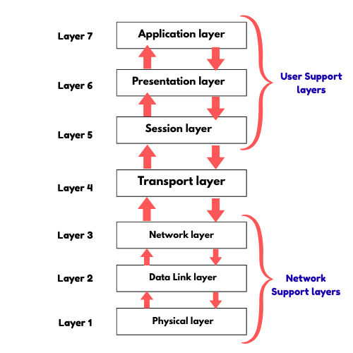

# 1. TCP/IP Model

The **TCP/IP Model** stands for **Transmission Control Protocol / Internet Protocol**.
It is the **fundamental communication model of the Internet** and was developed **before the OSI model**.
The TCP/IP model explains **how data is sent, routed, and received** over networks like the Internet.

> Unlike the OSI model (7 layers), the TCP/IP model has **4 layers**, and each layer has a specific role.

## Layers of TCP/IP Model

### Application Layer

* Topmost layer of TCP/IP
* Provides **network services to user applications**
* Combines **Application, Presentation, and Session layers** of OSI
* Common protocols:

  * **HTTP** – web browsing
  * **FTP** – file transfer
  * **SMTP / POP3** – email
  * **DNS** – domain name resolution

**Example:** Opening a website in a browser.

### Transport Layer

* Ensures **end-to-end communication** between devices
* Responsible for **data delivery, error control, and flow control**

**Protocols used:**

* **TCP** – reliable, connection-oriented (used in web, email)
* **UDP** – fast, connectionless (used in video streaming, gaming)
* **SCTP** – message-oriented transport protocol

**Example:** TCP ensures a webpage loads correctly.

### Internet Layer (Network Layer)

* Responsible for **logical addressing and routing**
* Decides **how data moves from source to destination across networks**

**Protocols used:**

* **IP (IPv4, IPv6)**
* **ICMP** (error reporting)
* **Routing protocols**

**Example:** Finding the best path to reach another network.

### Host-to-Network (Link) Layer

* Lowest layer of TCP/IP
* Handles **physical transmission of data**
* Equivalent to **Physical + Data Link layers** of OSI
* Deals with hardware, MAC addresses, cables, and NICs

**Example:** Sending bits over Ethernet or Wi-Fi.

## TCP/IP vs OSI (Quick Interview Point)

| OSI Model         | TCP/IP Model         |
| ----------------- | -------------------- |
| 7 Layers          | 4 Layers             |
| Theoretical model | Practical model      |
| Not used directly | Used by the Internet |

## Inshort

> **The TCP/IP model is a four-layer network model used by the Internet to transmit data reliably from source to destination.**

## Why TCP/IP is Important?

* Backbone of the **Internet**
* Platform-independent
* Highly **scalable and reliable**
* Used in **real-world networking**

---

# 2. What is the OSI Model?

The **OSI (Open Systems Interconnection) Model** was developed by the **International Organization for Standardization (ISO)**. It allows different communication systems to communicate using standard protocols. The OSI model provides a layered framework that explains how data should be transmitted between different systems over a network.

In simple words, the OSI model is a standard that helps computers from different vendors communicate with each other.

The OSI model divides network communication into **seven layers**. Each layer has a specific role and provides services to the layer above while receiving services from the layer below.

## Layers of the OSI Model

The seven layers of the OSI model are:

### Physical Layer

Responsible for transmitting raw bits over a physical medium such as cables. It deals with voltages, data rates, connectors, and hardware.

### Data Link Layer

Ensures reliable transfer of data frames between two directly connected nodes. It handles error detection and uses MAC addresses.

### Network Layer

Manages the delivery of packets from the source to the destination across multiple networks. It handles logical addressing and routing.
**Examples:** IP

### Transport Layer

Provides end-to-end communication between hosts. It ensures complete data delivery with error control and flow control.
**Examples:** TCP, UDP

### Session Layer

Establishes, manages, and terminates sessions between applications. It controls dialog and synchronization.

### Presentation Layer

Translates data formats, and handles encryption, decryption, and compression so that data is understandable by the receiver.

### Application Layer

The topmost layer that provides network services directly to user applications.
**Examples:** HTTP, FTP, SMTP, DNS

## How Does the OSI Model Work?

Data moves from the **Application layer down to the Physical layer** at the sender side.
It travels across the network and then moves **up from the Physical layer to the Application layer** at the receiver side.

Each layer performs its own function and passes the data to the next layer.

## Network Support vs User Support Layers

* **Network Support Layers:**
  Physical, Data Link, Network – deal with physical transmission of data.

* **User Support Layers:**
  Session, Presentation, Application – help user applications communicate.

* **Transport Layer:**
  Acts as a link between the two groups.

## Characteristics of OSI Model

* The **top layers** focus on software and user interaction.
* The **bottom layers** deal with hardware and physical data transmission.
* Each layer has a well-defined function.
* Changes in one layer do not affect others.

## Advantages of OSI Model

* It is a standard reference model for networking.
* Helps in understanding and designing networks.
* Supports both connection-oriented and connectionless services.
* Makes troubleshooting easier by isolating problems to specific layers.
* Adaptable to different protocols.

## Disadvantages of OSI Model

* Session and Presentation layers are less useful in real networks.
* Some functions are repeated across layers.
* Layers must work sequentially, which can add complexity.
* It is mostly theoretical and not directly implemented like TCP/IP.

## In Short

> The OSI model is a 7-layer framework that explains how data is transmitted from one computer to another over a network in a standardized way.

## Difference between OSI and TCP/IP Model

| **OSI Model**                                                                                | **TCP/IP Model**                                                                          |
| -------------------------------------------------------------------------------------------- | ----------------------------------------------------------------------------------------- |
| OSI stands for **Open System Interconnection**.                                              | TCP/IP stands for **Transmission Control Protocol / Internet Protocol**.                  |
| OSI is a **generic, protocol-independent** reference model.                                  | TCP/IP is based on **standard protocols** used on the Internet.                           |
| OSI model was **developed first**, then protocols were created.                              | In TCP/IP, **protocols were developed first**, then the model was built.                  |
| OSI model provides **quality services**.                                                     | TCP/IP model does **not focus on quality services**.                                      |
| OSI clearly defines **services, interfaces, and protocols** for each layer.                  | TCP/IP does **not clearly separate** services, interfaces, and protocols.                 |
| OSI model hides protocols and can be replaced easily.                                        | TCP/IP protocols are **not hidden** and are fixed.                                        |
| OSI model is considered **more complex**.                                                    | TCP/IP model is **simpler and practical**.                                                |
| OSI supports both **connection-oriented and connectionless** communication in network layer. | TCP/IP uses **connectionless IP** at network layer and both TCP & UDP at transport layer. |
| OSI uses a **vertical approach**.                                                            | TCP/IP uses a **horizontal approach**.                                                    |
| OSI model has **7 layers**.                                                                  | TCP/IP model has **4 layers**.                                                            |
| OSI is mainly used as a **reference/teaching model**.                                        | TCP/IP is used in **real networks and the Internet**.                                     |

