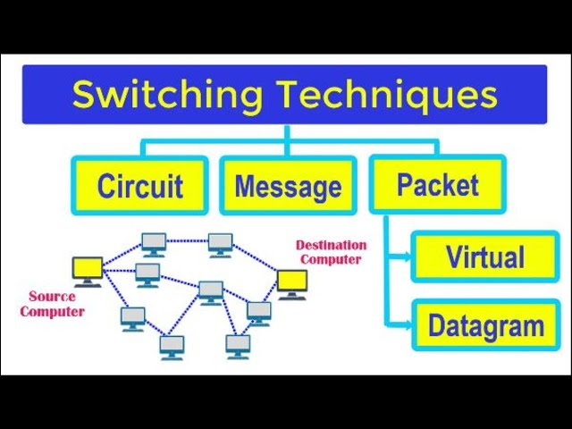

## **What is Physical Layer?**

Physical Layer is the **lowest layer** of the OSI model and is responsible for the **actual physical connection** between devices. It deals with the **transmission and reception** of unstructured raw bit streams over a physical medium.

**Position:** Layer 1 (Bottom-most layer)
**Main Function:** Physical transmission of data
**Data Unit:** Bits (0s and 1s)


## **Functions of Physical Layer**

### **1. Bit Synchronization**
- Ensures that sender and receiver clocks are synchronized
- Uses techniques like Manchester encoding, Differential Manchester encoding

### **2. Bit Rate Control**
- Defines transmission rate (bits per second)
- Manages data flow between devices

### **3. Physical Topologies**
- Defines how devices are connected physically
- Types: Bus, Star, Ring, Mesh, Tree, Hybrid

### **4. Transmission Mode**
- Defines direction of data flow:
  - **Simplex**: One-way communication
  - **Half-Duplex**: Two-way but not simultaneous
  - **Full-Duplex**: Two-way simultaneous communication

### **5. Line Configuration**
- Point-to-Point: Direct connection between two devices
- Multipoint: Multiple devices share same link


## **Physical Layer Standards & Protocols**

### **IEEE 802.3 (Ethernet Standards)**
- **10BASE-T**: 10 Mbps, Twisted Pair, 100m
- **100BASE-TX**: 100 Mbps, Twisted Pair, 100m
- **1000BASE-T**: 1 Gbps, Twisted Pair, 100m
- **10GBASE-T**: 10 Gbps, Twisted Pair, 100m

### **ITU-T Standards**
- V.32, V.34, V.90, V.92 for modems
- G.992.1 (ADSL), G.992.5 (ADSL2+) for DSL

### **EIA/TIA Standards**
- RS-232, RS-449 for serial communication
- Category standards for twisted pair cables


## **Transmission Media**

### **Guided Media (Wired)**

#### **1. Twisted Pair Cable**
- **UTP (Unshielded Twisted Pair)**:
  - Cheapest and most common
  - Categories: Cat-5, Cat-5e, Cat-6, Cat-7, Cat-8
  - Distance: 100 meters (LAN)
  - Bandwidth: Up to 10 Gbps (Cat-8)

- **STP (Shielded Twisted Pair)**:
  - Shielded against EMI
  - More expensive than UTP
  - Used in environments with high interference

#### **2. Coaxial Cable**
- **RG-59**: Used for cable TV
- **RG-58**: Used for Ethernet (10BASE-2, 10BASE-5)
- **Distance**: Up to 500m (thick coaxial)
- **Bandwidth**: Up to 1 GHz

#### **3. Fiber Optic Cable**
- **Single Mode Fiber (SMF)**:
  - Long distance transmission
  - Low attenuation
  - Distance: Up to 100km

- **Multi-Mode Fiber (MMF)**:
  - Short distance transmission
  - Higher bandwidth for short distances
  - Distance: Up to 2km

### **Unguided Media (Wireless)**

#### **1. Radio Waves**
- Frequency range: 3 KHz to 300 GHz
- Used in: AM/FM radio, TV broadcasting, microwave links
- Types: Ground waves, Sky waves, Space waves

#### **2. Microwaves**
- Frequency range: 1 GHz to 300 GHz
- Used for: Satellite communication, radar, wireless LAN
- Line-of-sight transmission required

#### **3. Infrared**
- Frequency range: 300 GHz to 400 THz
- Used for: Short-range communication (remote controls, IrDA)
- Cannot penetrate walls

---

## **Digital vs Analog Signals**

### **Digital Signals**
- Discrete values (0 or 1)
- More reliable and less affected by noise
- Used in digital communication systems
- Examples: Ethernet, USB, HDMI

### **Analog Signals**
- Continuous values
- Can represent infinite values
- More susceptible to noise and distortion
- Examples: Traditional telephone lines, radio signals

### **Signal Conversion**
- **Modem**: Modulates digital to analog (transmission), demodulates analog to digital (reception)
- **Codec**: Coder/Decoder for digital signals


## **Modulation Techniques**

### **Digital-to-Digital Conversion**
1. **Line Coding**: Converts digital data to digital signals
   - **NRZ (Non-Return to Zero)**
   - **NRZI (NRZ Inverted)**
   - **Manchester Encoding**
   - **Differential Manchester**
   - **Bipolar AMI**

2. **Block Coding**: Groups bits together
   - 4B/5B, 8B/10B encoding

3. **Scrambling**: Prevents long sequences of 0s or 1s
   - B8ZS, HDB3

### **Digital-to-Analog Conversion**
1. **ASK (Amplitude Shift Keying)**
2. **FSK (Frequency Shift Keying)**
3. **PSK (Phase Shift Keying)**
4. **QAM (Quadrature Amplitude Modulation)**

### **Analog-to-Analog Conversion**
1. **AM (Amplitude Modulation)**
2. **FM (Frequency Modulation)**
3. **PM (Phase Modulation)**


## **Bandwidth and Data Rate**

### **Bandwidth**
- Range of frequencies that a medium can carry
- Measured in Hertz (Hz)
- Higher bandwidth = Higher data transmission capacity

### **Data Rate**
- Amount of data transmitted per second
- Measured in bits per second (bps)
- Depends on bandwidth, signal strength, encoding technique

### **Nyquist Theorem**
```
Maximum data rate = 2 × Bandwidth × log₂(L)
Where L = number of signal levels
```

### **Shannon's Theorem**
```
Maximum data rate = Bandwidth × log₂(1 + SNR)
Where SNR = Signal-to-Noise Ratio
```

## **Multiplexing Techniques**

### **1. Frequency Division Multiplexing (FDM)**
- Divides bandwidth into frequency bands
- Each signal transmitted in different frequency range
- Used in: Cable TV, radio broadcasting

### **2. Time Division Multiplexing (TDM)**
- Divides time into slots
- Each signal gets a dedicated time slot
- Types: Synchronous TDM, Asynchronous TDM, Statistical TDM

### **3. Wavelength Division Multiplexing (WDM)**
- Used in fiber optics
- Different wavelengths carry different signals
- Types: CWDM, DWDM

### **4. Code Division Multiplexing (CDM)**
- Each signal assigned unique code
- All signals transmitted simultaneously
- Used in CDMA technology


## **Switching Techniques**



### **1. Circuit Switching**
- Dedicated path established between sender and receiver
- Resources reserved for entire communication
- Used in traditional telephone networks
- Phases: Setup, Data Transfer, Teardown

### **2. Packet Switching**
- Data broken into packets
- Each packet routed independently
- More efficient use of bandwidth
- Types: Datagram, Virtual Circuit

### **3. Message Switching**
- Entire message stored at intermediate nodes
- Forwarded when link available
- Slower than packet switching


## **Important Physical Layer Devices**

### **1. Repeater**
- Regenerates and amplifies signals
- Works at Physical Layer
- Extends network distance
- Cannot connect different network types

### **2. Hub**
- Multi-port repeater
- Broadcasts data to all ports
- Creates collision domain
- Works at Physical Layer

### **3. Modem**
- Modulates digital signals to analog
- Demodulates analog signals to digital
- Used for dial-up internet connections

### **4. Transceiver (NIC)**
- Network Interface Card
- Converts parallel data to serial
- Handles physical transmission


## **Error Detection at Physical Layer**

### **1. Parity Check**
- **Even Parity**: Makes total number of 1s even
- **Odd Parity**: Makes total number of 1s odd
- Simple but detects only single bit errors

### **2. CRC (Cyclic Redundancy Check)**
- More sophisticated error detection
- Uses polynomial division
- Detects multiple bit errors

### **3. Checksum**
- Sum of data divided into words
- Receiver verifies the sum


## **Physical Layer in TCP/IP Model**

TCP/IP model combines Physical and Data Link layers into **Network Access Layer**. Physical layer responsibilities in TCP/IP include:

- Defining hardware specifications
- Encoding/decoding signals
- Defining physical topologies
- Managing data transmission rates


## **Interview Questions & Answers**

### **Q1: What is the main function of Physical Layer?**
**Ans:** The Physical Layer is responsible for the actual physical connection between devices and the transmission of raw bit streams over physical media.

### **Q2: What are the different types of transmission media?**
**Ans:** Transmission media are classified as:
- **Guided Media**: Twisted Pair, Coaxial Cable, Fiber Optic
- **Unguided Media**: Radio Waves, Microwaves, Infrared

### **Q3: Explain the difference between UTP and STP cables.**
**Ans:**
- **UTP**: Unshielded Twisted Pair, cheaper, susceptible to EMI
- **STP**: Shielded Twisted Pair, expensive, protected against EMI

### **Q4: What is modulation?**
**Ans:** Modulation is the process of converting digital signals to analog signals for transmission over analog channels and vice versa.

### **Q5: Explain Nyquist theorem.**
**Ans:** Nyquist theorem states that maximum data rate = 2 × Bandwidth × log₂(L), where L is the number of signal levels.

### **Q6: What is the difference between simplex, half-duplex, and full-duplex?**
**Ans:**
- **Simplex**: One-way communication
- **Half-duplex**: Two-way but not simultaneous
- **Full-duplex**: Two-way simultaneous communication

### **Q7: What are the different multiplexing techniques?**
**Ans:** FDM (Frequency Division), TDM (Time Division), WDM (Wavelength Division), CDM (Code Division)

### **Q8: Explain the working of a repeater.**
**Ans:** A repeater receives signals, amplifies them, and retransmits them to extend the network range. It works at the Physical Layer.

### **Q9: What is the maximum distance for 10BASE-T Ethernet?**
**Ans:** 100 meters using Category 5 or higher twisted pair cables.

### **Q10: What is the difference between single-mode and multi-mode fiber?**
**Ans:**
- **Single-mode**: Long distance, single light ray, low attenuation
- **Multi-mode**: Short distance, multiple light rays, higher bandwidth for short distances


## **Key Points for Interviews**

1. **Physical Layer is Layer 1** in OSI model
2. **Deals with bits** (0s and 1s)
3. **Transmission media** classification is important
4. **Twisted Pair** is most commonly used in LANs
5. **Fiber Optic** provides highest bandwidth and distance
6. **Manchester encoding** provides both data and clock
7. **Repeater** works at Physical Layer only
8. **Hub** is a multi-port repeater
9. **Nyquist and Shannon theorems** are fundamental
10. **Ethernet standards** (802.3) are crucial
